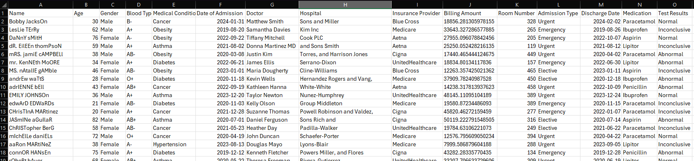
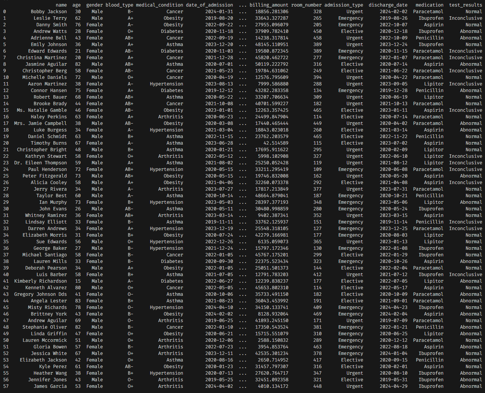

# HealthCare Dashboard

1. The raw data was obtained from [Kaggle](https://www.kaggle.com/datasets/prasad22/healthcare-dataset)
2. The raw data looks like this:

3. `pd_data_cleaner.py` simply runs basic operations on the data. This includes date normalization, name convention enforcement, and finally column property generator for further transformation wihtin SQL if required.

4. The transformed data set ready to be uploaded to SQL should look like this:

The purpose of the python script within is not to perform major transformations. As with most ETL's they are meant to be customized for a specific task. All this does, is create a baseline for the data to uploaded to the database for prosperity. Major transformations on ETL scripts should be avoided if possible. To illustrate this point, you will notice I left the billing amount untouched. The dashboard will take care of that.
